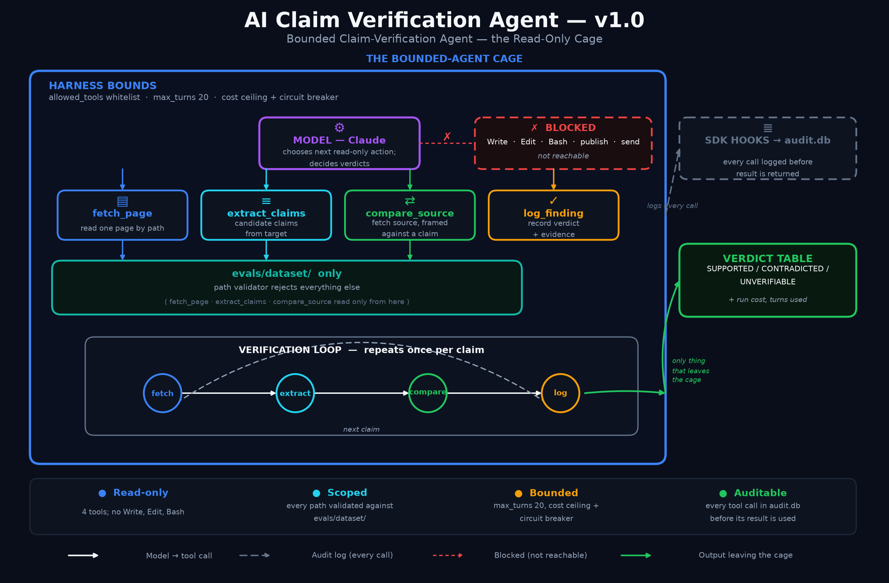

# ai-claim-verification-agent

Bounded claim-verification agent — verifies factual claims on content pages against source pages; read-only by harness enforcement.

**Status:** eval gate is green. Sonnet 4.6, 12 cases / 35 claims, precision 1.00, recall 1.00 — [full results](evals/EVAL_RESULTS.md). Repo visibility unchanged pending a separate decision (see ADR-001 on the public-prompts exception this repo takes once that decision is made).

## What It Does

Content pages — affiliate reviews, comparisons, product pages — make factual claims: prices, specs, availability, dates. Checking those claims against source pages by hand is slow and the first thing skipped under deadline. An unbounded agent could do the checking, but can't be trusted anywhere near live content without a harness that enforces its limits rather than just documenting them.

This agent takes one target page and a set of source pages, extracts the target's factual claims, investigates each one against the sources, and logs a verdict — SUPPORTED, CONTRADICTED, or UNVERIFIABLE — with the evidence that produced it. It can provably do nothing else: no writing, no editing, no shell, no network beyond the four tools below.

## Input

- One **target page** (the content being checked) and a set of **source pages** (what it's checked against). v1 scope: local, seeded HTML files under `evals/dataset/` — see [Known Limitations](evals/EVAL_RESULTS.md#known-limitations) for what that does and doesn't prove about live web content.
- A **comparison policy** — how to treat numeric mismatches, rephrasing, source authority, and no-coverage claims — loaded from [`evals/eval_config.yaml`](evals/eval_config.yaml) at *runtime*, not copied into the agent's prompt file. The policy lives in exactly one place.

## System

Built on the Claude Agent SDK (Python). The harness — not a README promise — enforces every bound:

- `allowed_tools` is exactly the 4 custom in-process MCP tools below; `tools=[]` disables every built-in (no Write, Bash, Edit, Read).
- `max_turns` caps each run at 20 turns.
- A per-run cost ceiling (`max_budget_usd`) plus a tool-call-count circuit breaker in the tool wrapper itself — two independent backstops, one SDK-level, one in-process.
- An SDK `PreToolUse`/`PostToolUse` hook pair writes every tool call to a SQLite audit trail (`audit.db`) *before* its result is used by the model — see [`agent/audit.py`](agent/audit.py).
- Models: Haiku 4.5 for dev iterations, Sonnet 4.6 for eval and demo runs. Billed to Claude subscription (Max plan) auth, not a per-token API key — see `SPEC.md` → Models & cost for why.

## Output

A verdict table (claim → verdict → evidence source), one summary line, and a final line reporting run cost and turns used — one screen, no scrollback. Every tool call behind that output is recorded in `audit.db`, independent of what the printed report shows.

## Value

Turns a manual, easy-to-skip check into a single bounded command whose failure mode is "wastes one read-only tool call," never "does something irreversible." The four-tool whitelist and the audit trail mean the bound is checkable after the fact, not just promised up front — [`tests/test_bounds.py`](tests/test_bounds.py) verifies it mechanically against a real run's audit log.

## Tools

The model gets exactly these four in-process MCP tools ([`agent/tools.py`](agent/tools.py)) — all read local HTML under `evals/dataset/` or append to an in-memory findings list; none can write, edit, execute, or reach outside that directory:

| Tool | What it does |
|---|---|
| `fetch_page` | Fetch one local HTML page by path, return its title and paragraphs. Rejects any path outside `evals/dataset/`. |
| `extract_claims` | Return the target page's paragraphs as a numbered list of candidate claims. Deterministic segmentation — the model decides which are worth verifying. |
| `compare_source` | Fetch a source page, framed against a specific claim, and return its full content. Does **not** judge the claim itself — see Key Logic. |
| `log_finding` | Record one claim's final verdict (SUPPORTED / CONTRADICTED / UNVERIFIABLE), the evidence source, and a short note. The only way the agent can "output" anything. |

## Key Logic (high-level)

1. `extract_claims` on the target page produces the candidate claims.
2. For each claim, the model calls `compare_source` (and `fetch_page` as needed) against the relevant source page(s).
3. **The model decides the verdict — no tool computes it.** `extract_claims` does no semantic judgment and `compare_source` does no matching or scoring; both are deterministic fetch-and-frame operations. The model reads the returned page content, applies the comparison policy from its system prompt (numeric claims need exact matches, rephrasing of the same fact is equivalent, authoritative sources outrank forum chatter, no source coverage means UNVERIFIABLE not CONTRADICTED), and reasons to a verdict itself.
4. The model calls `log_finding` once per claim with that verdict, its evidence source, and a note.
5. This is Bounded-AI v2 (ADR-001): the model chooses its next *read-only investigative* action from the fixed whitelist, within step/turn/cost limits — it never publishes, edits, sends, or makes an irreversible change. A bad decision costs at most one wasted tool call.

## Proof

**Official gate run — Sonnet 4.6, 2026-07-06** ([full report](evals/EVAL_RESULTS.md)):

| Metric | Value | Threshold | Result |
|---|---|---|---|
| Precision (positive class: CONTRADICTED) | 1.0000 (8/8) | ≥ 0.95 | PASS |
| Recall (positive class: CONTRADICTED) | 1.0000 (8/8) | ≥ 0.90 | PASS |
| Overall verdict accuracy (secondary, not gated) | 1.0000 (35/35) | — | — |

12 cases / 35 claims, $0.9047 total run cost, no case hit `max_turns` or the budget ceiling.

**Audit-trail design:** every tool call is written to SQLite by a `PreToolUse`/`PostToolUse` hook pair *before* its result reaches the model — see [`agent/audit.py`](agent/audit.py) and ADR-001. This isn't just asserted: [`tests/test_bounds.py`](tests/test_bounds.py) runs against a real run's `audit.db` and mechanically checks (a) every path any tool call touched resolves inside `evals/dataset/`, with explicit escape-attempt cases (`../`, absolute paths) asserted rejected at both the resolver and the tool level, and (b) `evals/ground_truth.json` — the fixed answer key — never appears in any tool input or output the model saw.

**Honest caveat:** all 12 eval cases are synthetic, hand-seeded HTML — not live web pages — so this gate proves the harness and the model's reasoning against controlled, known-truth claims, not robustness to real-world markup noise. See [Known Limitations](evals/EVAL_RESULTS.md#known-limitations) for what that does and doesn't cover.

## Out of Scope (Production Upgrades)

Per `SPEC.md`, these are deliberately not built and have no trigger yet:

- Live-web crawling at scale
- Multi-agent teams
- Subagents
- Dashboards
- Scheduled runs
- Auto-fixing content

---

## Problem

Manually checking whether a content page's claims match its sources doesn't scale and is the first check dropped under deadline pressure — see What It Does above for the full framing.

## Solution

A harness-bounded agent that can investigate (read-only, four tools, capped turns/cost) and log verdicts, but structurally cannot publish, edit, or take any irreversible action — see System and Key Logic above.

## Outcome

Official gate: **PASS** on Sonnet 4.6 — precision 1.00, recall 1.00, 35/35 claims correct, $0.90 total run cost, zero capped cases. Full detail in [evals/EVAL_RESULTS.md](evals/EVAL_RESULTS.md).

## Version Log

| Version | Date | Change |
|---|---|---|
| 0.1 | 2026-07-05 | Tier 0 scaffold, SPEC.md, ADR-001, eval gate config committed before any agent code. |
| 0.2 | 2026-07-05 | Synthetic eval dataset (12 cases/35 claims) + ground truth committed, fixed before agent code. |
| 0.3 | 2026-07-06 | Bounded harness + 4 MCP tools + system prompt; verified single-case run (Haiku, subscription auth). |
| 0.4 | 2026-07-06 | Eval runner (per-case isolation); Haiku shakedown 35/35. |
| 0.5 | 2026-07-06 | Official gate run on Sonnet 4.6: PASS. Cost-ceiling bug found and fixed along the way. |
| 0.6 | 2026-07-06 | SPEC.md cost-model correction; bounds regression test (`tests/test_bounds.py`); full README. |
